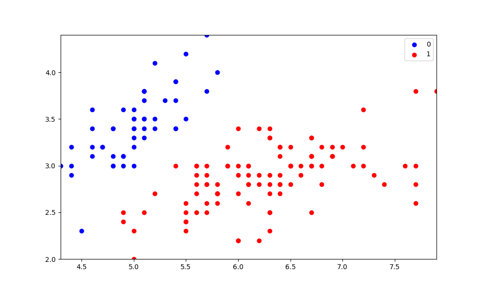

# Logistic Regression

The Supervised Learning methodology of logistic regression is used to predict the categorical dependent variable using a set of independent factors. A categorical dependent variable's output is predicted using logistic regression. As a result, the result must be a discrete or categorical value. Logistic Regression is much similar to Linear Regression except that how they are used. Linear Regression is used for solving Regression problems, whereas Logistic regression is used for solving the classification problems. 

```python
from ravml.linear.logistic_regression import LogisticRegression
model = LogisticRegression(lr=0.1, num_iter=30)

model.fit(X, y)

preds = model.predict(X)

print((preds == y).mean())
print(model.theta())

model.plot_loss()

model.visualize(X,y)
```


<B><center>
## Methods
</center>
</B>

- ### <B><U>fit(X,y)</u></B>

>| Parameters | Description     |
>| :------------ |:---------------:|
>|    X {dtype:list/numpy_ndarray,shape:(n_samples,n_features)} | array like matrix denoting the input array for training | 
>|    y {dtype:list/numpy_ndarray,shape:(n_samples)} | array like matrix the input classes | 

- ### <U><B>predict(X)</B><br></U>

> 
>
>| Parameters | Description     |
>| :------------: |:---------------:|
>|    X {shape:(n_samples,n_features)} |The data matrix for which we want to get the predictions.  |


- ### <U><B>plot_loss()</B><br></U>
>plots the loss function of the model with respect to the iterations.

- ### <U><B>visualize(X,y)</B><br></U>
>visualize the predicted values using matplotlib .
>| Parameters | Description     |
>| :------------: |:---------------:|
>|    X {dtype:list/numpy_ndarray,shape:(n_samples,n_features)} | array like matrix denoting the input array for training | 
>|    y {dtype:list/numpy_ndarray,shape:(n_samples)} | array like matrix the input classes | 


<B><center><U>
## Example and Results
</center></U>
</B>

```python
import ravop.core as R
from ravml.linear.logistic_regression import LogisticRegression
from sklearn import datasets

iris = datasets.load_iris()

X = iris.data[:, :2]
y = (iris.target != 0) * 1

algo = R.Graph(name='logrig', algorithm='logistic_regression', approach='distributed')


model = LogisticRegression(lr=0.1, num_iter=20)

model.fit(X, y)

preds = model.predict(X)
print((preds == y).mean())
print(model.theta())

model.plot_loss()

model.visualize(X,y)

algo.end()
```
visualization of the classifed training data after running it for 20 iterations with a learning rate of 0.01.

<center></center>


You can view the implementation of Logistic Regression on IRIS flower dataset [*here*](https://github.com/ravenprotocol/ravml/tree/main/examples/logistic_regression.py).
